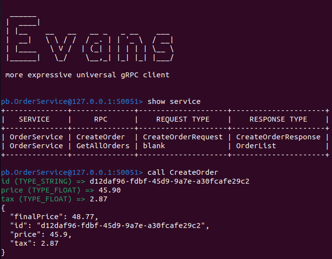

# Clean Arch Challenge

## Golang configuration
Check if PATH variable has golang configuration or add in the `~/.zshrc` file the following line:
```
export PATH="$HOME/go/bin:/usr/local/go/bin:$PATH"
```

## Database
```bash
docker-compose exec mysql bash
mysql -u root -p
```

```sql
CREATE DATABASE IF NOT EXISTS orders;

USE orders;

CREATE TABLE IF NOT EXISTS orders (
    id VARCHAR(255) NOT NULL,
    price DOUBLE NOT NULL,
    tax DOUBLE NOT NULL,
    final_price DOUBLE NOT NULL,
    PRIMARY KEY (id)
);
```

## GraphQL
- change the paths in **gqlgen.yml** to generate file in desired folder (internal/infra/graph)

## Playground
```graphql
mutation {
  createOrder(input: { id: "123", Price: 100.0, Tax: 10.0 }) {
    id
    Price
    Tax
    FinalPrice
  }
}
```

```graphql
query {
  orders {
    id
    Price
    Tax
    FinalPrice
  }
}
```

### Errors
Invalid memory address or nil pointer error when try generate command
Fix:
```bash
rm go.sum && go get -u github.com/99designs/gqlgen
go mod tidy

go run github.com/99designs/gqlgen generate
```

## Google Wire
[Documentation](https://github.com/google/wire)

```bash
go install github.com/google/wire/cmd/wire@latest

# check if the wire folder was created
ls ~/go/bin
```

After change the _wire.go_ file, run the `wire` command into ___cmd/ordersystem___ folder to update the _wire_gen.go__ file.


## gRPC
[Go documentation](https://grpc.io/docs/languages/go/quickstart)

Install and check the protobuf compiler version
```bash
sudo apt install protobuf-compiler

protoc --version
```

Install Go plugins
```bash
go install google.golang.org/protobuf/cmd/protoc-gen-go@latest

go install google.golang.org/grpc/cmd/protoc-gen-go-grpc@latest

# to check if the folders protoc-gen-go and protoc-gen-go were created
ls ~/go/bin
```

Install __vscode-proto3__ plugin to work with `.proto` files.

After change a _.proto_ file run the following command in the root project folder:
```bash
protoc --go_out=. --go-grpc_out=. internal/infra/grpc/protofiles/order.proto
```

The files _order_grpc.pb.go_ and _order.pb.go_ in _pb_ folder will be updated.


### Install Evans
```bash
go install github.com/ktr0731/evans@latest

# to check if the folder evans was created
ls ~/go/bin
```

Run __evans__ command in the project root folder:
```bash
evans --proto internal/infra/grpc/protofiles/order.proto repl
```

<p>Show available services:</p>


<p>Create an order:</p>


<p>Get all orders:</p>

